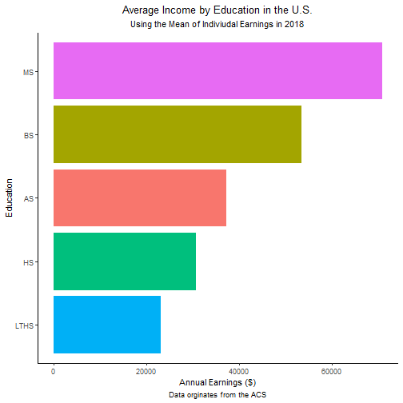
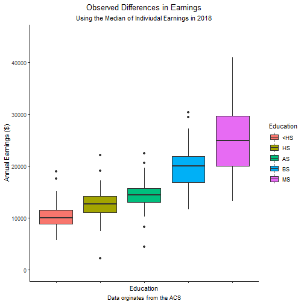
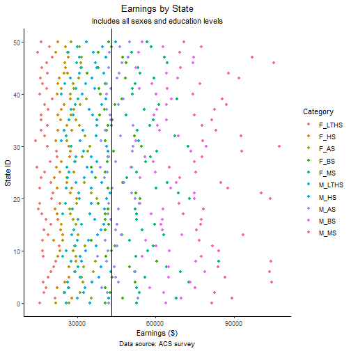
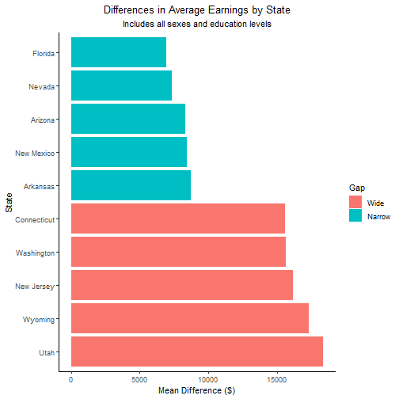
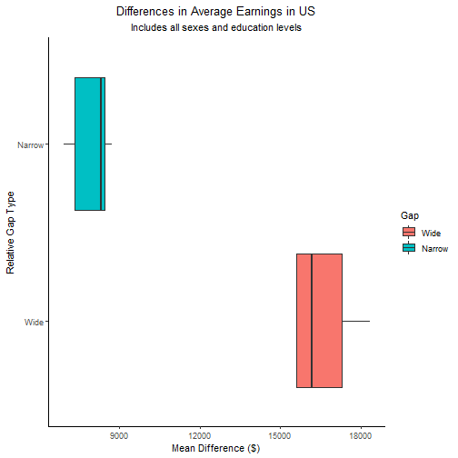
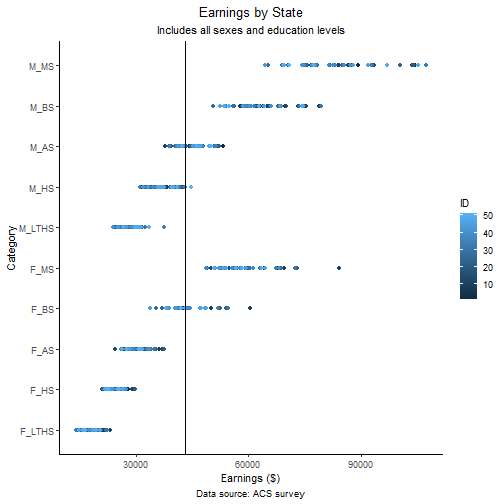

Project_Presentation
========================================================
author: Zachary Palmore
date: December 1, 2020
autosize: true


Overview
========================================================
In this analysis we examine the earnings from education attainment and the gender wage gap of the United States


Overview
========================================================
In this analysis we examine the earnings from education attainment and the gender wage gap of the United States

Common thoughts:

Overview
========================================================
In this analysis we examine the earnings from education attainment and the gender wage gap of the United States

Common thoughts:

- Education increases earnings for both genders

Overview
========================================================
In this analysis we examine the earnings from education attainment and the gender wage gap of the United States

Common thoughts:

- Education increases earnings for both genders
- Education decreases the gender wage gap

Overview
========================================================
In this analysis we examine the earnings from education attainment and the gender wage gap of the United States

Common thoughts:

- Education increases earnings for both genders
- Education decreases the gender wage gap
- Some states have significantly improved the gap


Objective
========================================================
To determine the validity of these thoughts a question was formed


Objective
========================================================
To determine the validity of these thoughts a question formed

"For people age twenty-five and older, does the level of education attained have an affect on the average
annual earnings of males and females across the United States in 2018? If so, is there a difference by state?" 


Summary: Data
========================================================
Data from the ACS was used with the median incomes of individuals' earnings in each state. It included:

- Median individual earnings
- Education levels
- Binary genders
- State names
- Demographics

Used ACS 2018 5-year survey

Summary: Part 1
========================================================
Presence of a wage gap:


```r
pfm.ft <- earnings %>% 
  summarise(Pfm_ft = mean(fft)/mean(mft))
pfm.ft <- round(pfm.ft, digits = 4)
pfm.ft
```

```
# A tibble: 1 x 1
  Pfm_ft
   <dbl>
1  0.797
```

The proportion of female to male earnings is about 80% In no state was the proportion greater than 87%.

Summary: Part 2
========================================================
Does education increase median earnings? 


```r
avgincomebyedu_col_earnswkly
```


Yes! Otherwise, why are so many of us here?

Summary: Part 2
========================================================
Same chart, new units for reference.


```r
avgincomebyedu_col_earnsyrly
```




Summary: Part 3
========================================================
How does education effect the difference in wage of gender?


```r
obsdif_earns_edu
```



It appears to increase and spread with higher education

Summary: Part 3
========================================================
How does education effect the difference in earnings by gender AND state?


```r
state_earnings_wedu
```



Summary: Part 3
========================================================
Examples of states observed differences in earnings


```r
sel5states_gap
```




Summary: Part 3
========================================================
Gap between state types is wide and stretching?


```r
stategap_dif_box
```




Statistics
========================================================
Two calculations were made using one-way analysis variance (ANOVA). 

Test #1

- null: There is no evidence education has an effect on median earnings for individuals in 2018
- alternate: There is evidence education has an effect on median earnings for individuals in 2018

Statistics
========================================================
Results of test #1


```r
mfobs.mean <- mf_stateobs[1:510,] %>% 
  summarise(mean = mean(Observation))
mfobs.anova <- anova_test(mf_state_obsdiffs, Difference ~ Observation)
mfobs.anova
```

```
ANOVA Table (type II tests)

       Effect DFn DFd       F        p p<.05   ges
1 Observation   4 250 106.948 5.73e-53     * 0.631
```

Significant at a level of 0.0001. Increasing earnings with higher education is extremely unlikely to have occurred by chance. Higher education has a strong correlation with higher average earnings. 

Statistics
========================================================
Test #2

- null: There is no significant difference by state in the observed differences of earnings from education of individuals
- alternate: There is a significant difference by state in the observed differences of earnings from education of individuals


Statistics
========================================================
Results of test #2


```r
mfstobs.anova <- anova_test(mf_stateobs[1:510,], Observation ~ ID)
mfstobs.anova
```

```
ANOVA Table (type II tests)

  Effect DFn DFd     F     p p<.05     ges
1     ID   1 508 0.402 0.526       0.00079
```

Results of this hypothesis test are not significant and the variation in the median earnings of each education level by state is likely due to chance.

Statistics
========================================================
When we review, this result makes sense. There is no cluster of states nor a solid block of color in the state earnings by education level. 


```r
stateedu_earnings_clusters
```



Conclusion
========================================================
Returning to those thoughts:

- Education increases earnings for both genders (TRUE)
- Education decreases the gender wage gap (FALSE)
- Some states have significantly improved the gap (FALSE)

Additionally
========================================================
On average across this entire study, females working full-time make $11,510 less than males per year. 

From 25 to 54, this could result in a difference of $333,790 if trends in observed differences held constant. 

The average male earns $51,477 per year 
and would accumulate $1,492,833 over the same working duration if variables remained constant. 


